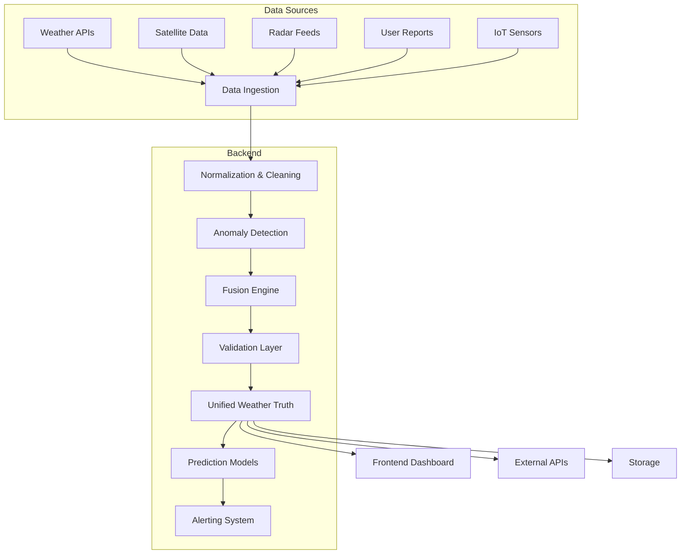
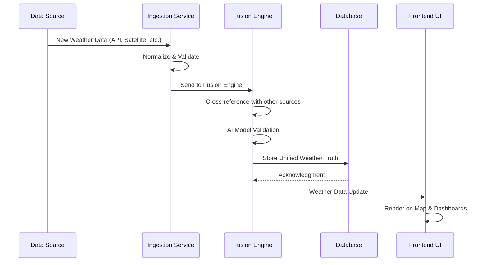
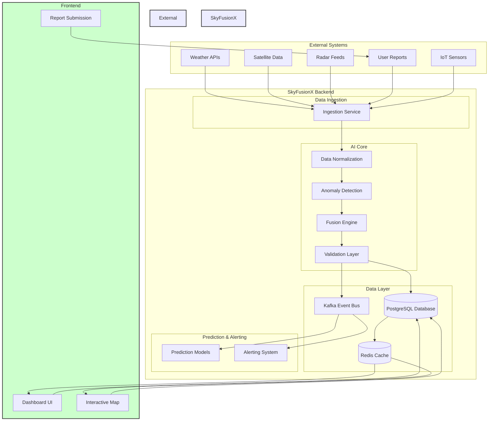

# SkyFusionX 🌦️

**Advanced fusion of weather data from heterogeneous sources**

SkyFusionX is a cutting-edge AI-powered weather truth engine that aggregates, validates, and fuses weather data from multiple sources to provide the most accurate and reliable weather insights possible.

## 🚀 Overview

**Problem:** Weather data from different sources (satellites, ground stations, weather models, user reports) often has gaps, inconsistencies, or varying levels of accuracy.

**Solution:** SkyFusionX uses advanced AI techniques—including multi-modal fusion, anomaly detection, and neural-symbolic reasoning—to combine these disparate data streams into a unified, trustworthy weather truth.

## 🌟 Key Features

- **Multi-Source Fusion:** Seamlessly integrates data from:
  - ✅ Meteorological services (NOAA, Met Office, etc.)
  - ✅ Satellite imagery (NASA, ESA)
  - ✅ Radar networks
  - ✅ IoT weather stations
  - ✅ User-submitted reports

- **AI-Powered Validation:**
  - 🔍 **Anomaly Detection:** Identifies sensor malfunctions or erroneous reports
  - 🤖 **Neural Consistency Checks:** Uses machine learning models to validate observations
  - ⚖️ **Source Trust Scoring:** Automatically weights data based on source reliability

- **Temporal Interpolation:** Intelligent gap-filling using time-series analysis

- **Spatial Analysis:** Creates unified weather grids with high spatial resolution

- **Real-time Streaming:** Kafka-based event-driven architecture for low-latency updates

##  architectural



### Key Components

- **Data Ingestion:** Collects data from multiple APIs and sources
- **Normalization:** Standardizes data formats and units
- **Anomaly Detection:** Identifies outliers and sensor errors
- **Fusion Engine:** Multi-modal AI fusion with trust scoring
- **Validation Layer:** Neural-symbolic consistency checks
- **Unified Weather Truth:** The final, trusted weather state

## 🛠️ Getting Started

### Prerequisites

- Python 3.9+
- Node.js 16+
- PostgreSQL 13+
- Kafka 3.0+

### Installation

#### 1. Clone the repository

```bash
git clone <repository-url>
cd SkyFusionX
```

#### 2. Backend Setup

```bash
cd backend
python -m venv venv
venv\Scripts\activate
pip install -r requirements.txt
```

Configure your PostgreSQL connection in `backend/.env`:

```env
DB_HOST=localhost
DB_PORT=5432
DB_NAME=skyfusionx
DB_USER=your_user
DB_PASSWORD=your_password
```

Run database migrations:

```bash
./venv/Scripts/python manage.py db upgrade
```

Start the backend:

```bash
./venv/Scripts/python manage.py run_local.py
```

Backend will be available at `http://localhost:8000`

#### 3. Frontend Setup

```bash
cd frontend
npm install
npm start
```

Frontend will be available at `http://localhost:3000`

## 📊 Data Flow



## 🎓 AI Techniques Used

- **Multi-modal Fusion:** Combining different data modalities (tabular, image, time-series)
- **Neural Consistency Checking:** Validating data using neural networks
- **Anomaly Detection:** Isolation Forest and autoencoders for outlier detection
- **Time-Series Interpolation:** LSTM and Prophet for gap filling
- **Trust Scoring:** Dynamic source reliability calculation
- **Neural-Symbolic Reasoning:** Combining deep learning with logical rules

## 🧩 Architecture Options

### Local Development

```bash
# Start backend
cd backend
.\venv\Scripts\python.exe .\run_local.py

# Start frontend
npm run dev
```

### Production Deployment

```bash
# Backend (Docker)
docker-compose up -d

# Frontend (Nginx)
docker build -t frontend .
docker run -d -p 80:80 --name frontend frontend
```

## 🧪 Testing

### Backend Tests

```bash
.\venv\Scripts\python.exe -m pytest tests/
```

### Frontend Tests

```bash
npm test
```

## 📈 Architecture Diagram



## 🤝 Contributing

Contributions are welcome! Please read our [CONTRIBUTING.md](CONTRIBUTING.md) for details on our code of conduct and the process for submitting pull requests.
