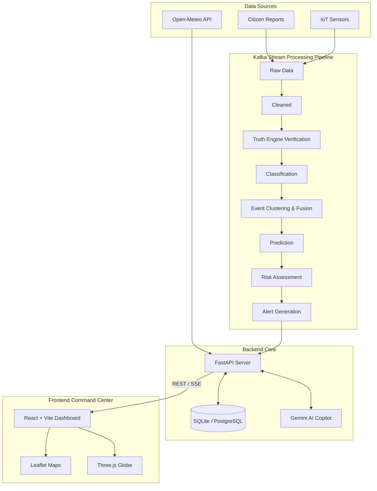

# SkyFusionX 🌦️

**SIH26069 — National Weather Big Data Analytics Platform**

SkyFusionX is a full-stack, AI-powered weather truth engine built to aggregate, validate, and fuse weather data from multiple heterogeneous sources. Designed for the SIH26069 problem statement, it processes real-world weather data and citizen reports to provide a unified, highly confident "weather truth".

---

## 🎯 Problem Statement (SIH26069)
Weather data collected from disparate sources (satellites, radar, citizen reports, IoT devices) often contains inconsistencies, gaps, and fake or erroneous reports. The challenge is to build a robust big data analytics platform that can ingest this massive volume of data, intelligently identify and filter out fake evidence, and fuse the remaining accurate data into actionable intelligence.

## 💡 Our Solution
SkyFusionX solves this by passing all ingested data through a **10-Stage Intelligence Pipeline** powered by Kafka stream processing and a custom **Truth Engine**. Citizen reports and sensor data are cross-referenced against real-time Open-Meteo forecasts, historical patterns, and geospatial clustering. Verified reports are then grouped into significant "Weather Events", assigned a risk score, and presented on a dynamic React dashboard for command center monitoring.

---

## 🌟 Key Features

- **10-Stage Stream Processing Pipeline:** Data moves asynchronously through 10 Kafka topics: `RAW` ➔ `CLEANED` ➔ `VERIFIED` ➔ `CLASSIFIED` ➔ `CLUSTERED` ➔ `PREDICTED` ➔ `RISK` ➔ `ALERTS`.
- **Truth Engine (Evidence Verification):** Validates every incoming report against 7 parameters (Source Reliability, Location Plausibility, Temporal Consistency, Weather Agreement, Nearby Corroboration, Media Quality, Historical Match) to assign a deterministic `Trust Score` (0-100).
- **Real-World Weather Ingestion:** Continuous background polling of the Open-Meteo API to ground citizen reports against actual meteorological data.
- **Event Clustering & Fusion:** Groups temporally and geographically related reports into unified Weather Events using HDBSCAN clustering concepts.
- **AI Copilot (RAG):** A Gemini-powered, location-aware chat assistant that grounds responses in the live Open-Meteo forecasts and our internal application database.
- **Interactive Command Center:** A premium React dashboard featuring live Leaflet maps, 3D globes (Three.js), and deep analytics (Recharts) for real-time monitoring.

---

## ⚙️ Complete System Architecture



---

## 🛠️ Technology Stack

**Frontend & UI:**
- React 18, Vite, TypeScript
- Tailwind CSS (Styling)
- React-Router-DOM (Navigation)
- React-Leaflet (Interactive 2D Maps)
- React-Three-Fiber / Three.js (3D Globe)
- Recharts (Analytics and Visualizations)

**Backend & APIs:**
- FastAPI & Uvicorn (REST APIs & SSE Streams)
- Python 3.9+
- SQLAlchemy (ORM) & Pydantic (Data Validation)

**Database & Storage:**
- SQLite (Configured for local development)
- PostgreSQL (Supported for production via SQLAlchemy)

**Stream Processing & AI:**
- Kafka (`aiokafka` for event streaming)
- Scikit-learn, HDBSCAN (Clustering & ML)
- Google GenAI (Gemini 3.5 Flash/Lite) for AI Copilot and Image Verification fallback.

---

## 📂 Project Structure

```text
SkyFusionX/
├── backend/
│   ├── app/
│   │   ├── api/          # FastAPI Routes (auth, dashboard, copilot, etc.)
│   │   ├── core/         # DB connection, Config (.env)
│   │   ├── intelligence/ # TruthEngine, Classifier, FusionEngine, RiskEngine
│   │   ├── models/       # SQLAlchemy Database Models
│   │   └── services/     # Weather ingestion, Gemini integration, Schedulers
│   ├── stream/           # Kafka stream processors and consumers
│   ├── run_local.py      # Entry point for local backend server
│   └── requirements.txt  # Python dependencies
├── src/                  # React Frontend Code
│   ├── components/       # Reusable UI, Layout, Maps, Charts
│   ├── context/          # React Context (App state, Demo modes)
│   ├── pages/            # 15+ Dashboard views (Live Intel, Truth Engine, etc.)
│   └── services/         # Frontend API clients
├── package.json          # Node dependencies
└── vite.config.ts        # Vite configuration
```

---

## 🚀 Installation & Setup

### Prerequisites
- Node.js 18+
- Python 3.9+
- Apache Kafka 3.0+ (Required for the stream processing pipeline)

### 1. Environment Variables
Create a `.env` file in the `backend/` directory:

```env
DATABASE_URL=sqlite:///./weather_truth.db
KAFKA_BOOTSTRAP_SERVERS=localhost:9092
GEMINI_API_KEY=your_gemini_api_key_here
WEATHER_REFRESH_INTERVAL_MINUTES=15
```

### 2. Backend Setup
```bash
cd backend
python -m venv venv

# Activate virtual environment
# Windows:
venv\Scripts\activate
# Unix/MacOS:
source venv/bin/activate

# Install dependencies
pip install -r requirements.txt

# Run the local backend server (starts FastAPI, Kafka Consumers, and background scheduler)
python run_local.py
```
*The backend will be available at `http://localhost:8000`.*

### 3. Frontend Setup
```bash
# From the root directory
npm install
npm run dev
```
*The frontend command center will be available at `http://localhost:5173`.*

---

## 📊 Current Implementation Status & Limitations

**What is actually implemented:**
- The **10-stage Kafka stream processing pipeline** is fully functional in `backend/stream/processor.py`.
- The **Truth Engine** is implemented and actively scores incoming observations against rules and live data.
- **Live Weather Ingestion:** The background scheduler actively polls Open-Meteo based on geographical data.
- **RAG Copilot:** Fully integrated with Gemini, providing context-aware answers based on the local SQLite database and Open-Meteo API.
- **React Dashboard:** 15+ complex views including Truth Engine diagnostics, Clustering maps, Risk Heatmaps, and timeline analytics.

**Limitations (Prototype constraints):**
- **Local DB:** Currently defaults to SQLite for ease of hackathon setup, though PostgreSQL is supported via SQLAlchemy.
- **Deterministic Clustering:** Geospatial clustering relies on deterministic coordinate rounding in the local environment instead of deep HDBSCAN models to avoid heavy local computation.
- **External LLM Dependency:** Uses Gemini API for NLP and image verification. In a strictly isolated national deployment, this would need to be replaced with a local open-source LLM.

---

## 🔮 Future Improvements

1. **Distributed Database Migration:** Move from SQLite to a distributed PostgreSQL or Cassandra cluster for national-scale read/write throughput.
2. **Direct Satellite Integration:** Tap directly into INSAT raw satellite feeds instead of relying exclusively on external meteorological APIs.
3. **Local LLM Deployment:** Replace the Gemini API dependency with a locally hosted LLaMA or Mistral model for air-gapped security compliance.
